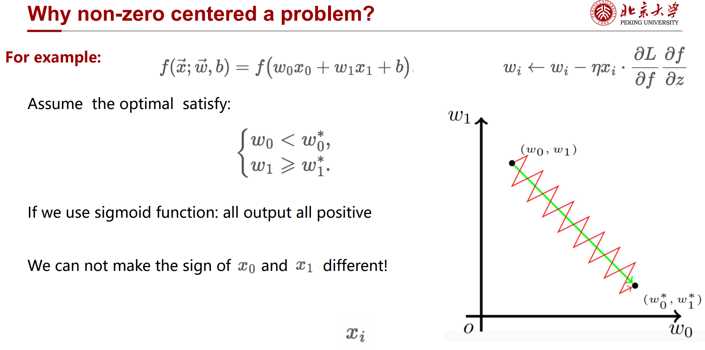
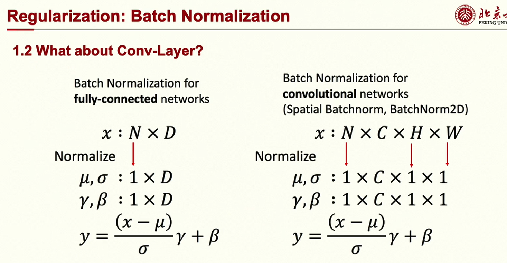
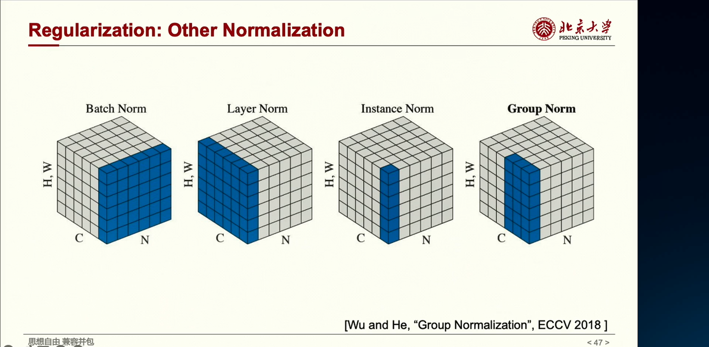
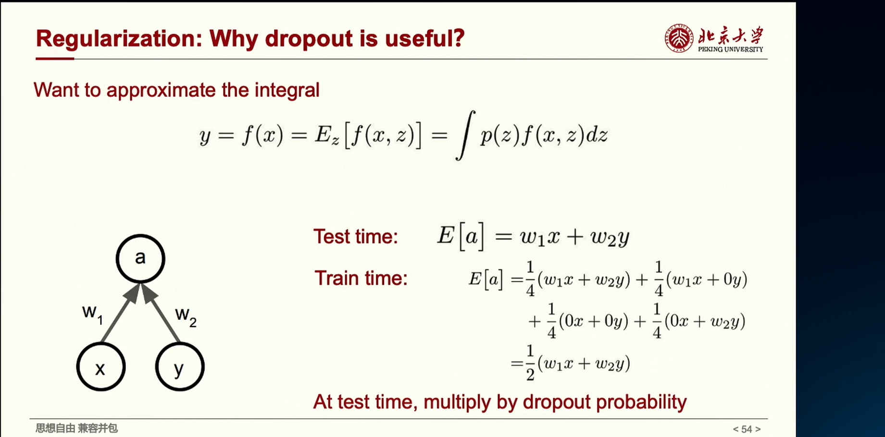
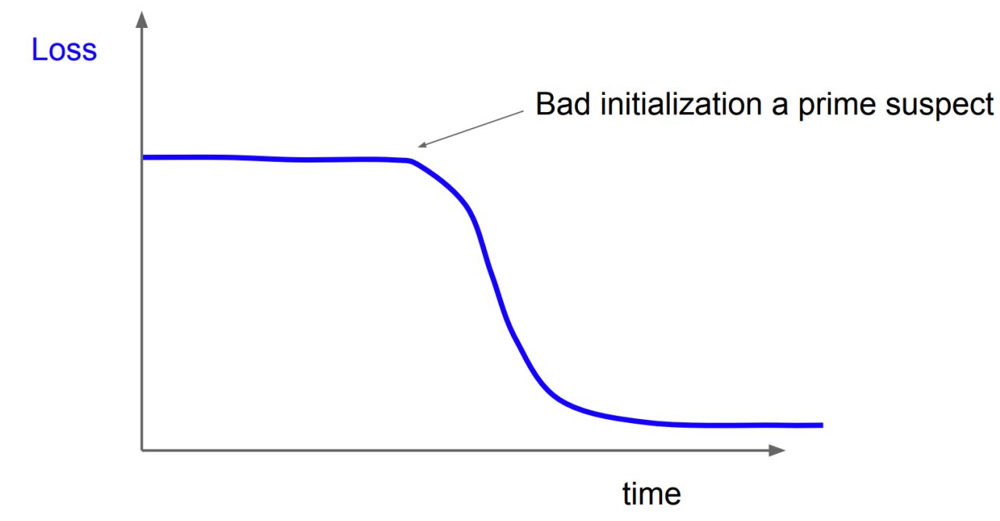

## Deep Learning

Gradient Descent: use the whole dataset to compute gradient. Stable

Stochastic GD-1: use one random data to calculate gradient. Efficient

SGD mini-batch: a balance of the above two, 减小计算量和内存要求, and at the same time stable than SGD-1.

## Activation

### Sigmoid

Pros:
- Squishes everything in the range $[0,1]$. Thus Can be interpreted as “probability"
- Has well defined gradient ever

Cons:

- Saturated neurons “kill” the gradients - gradient disappearance

- Non-zero centered
- Exponential Form - Could be expensive to compute

Why we need 0-centred activation? 

Sign determines the direction of GD. May cause slow convergence.

### tanh

Pros:

- Squishes everything in the range [-1,1]
- Centered around zero

- Has well defined gradient everywhere

Cons:
- Saturated neurons “kill" the gradients

### ReLU

Pros:
- Does not saturate (for x > 0)
- Computationally very efficient
- Converges faster in practice (e.g. 6 times faster)

Also Leaky and Parameterised

## Overfitting Prevention

1. induce randomness in train: dropout, regularisation 

regularization: punishes too complicated weights, to prevent the model from doing **too well** on training data

early terminate: validation sets

Batch Normalisation will also learn a scale and offset. So actually it maps original data to unit gaussian and  then do a linear transformation.

1. **Regularization Effect:** BatchNorm introduces a slight regularization effect, reducing the reliance on dropout or other regularization techniques. This is because the normalization process adds a small amount of noise to the activations.

Can normalization prevent that? normalize before activation: scale to sensitive range

$n$ books each $c$ pages one page a pic of $h*w$.

- Batch normalisation: normalisation on all the $c^{th}$ page of all $N$ book.

- Layer normalisation: 

  Normalisation for each book.

  Don't care about batch size or online algorithm, often used in rnn or transformer

- Instance normalisation: only on the graph $H\times W$, in style transfer galore

In the testing phase, instead of using the mean and standard deviation of the current mini-batch, BatchNorm uses the running averages of these statistics calculated during training. This helps maintain consistency with the normalisation applied during training.

dropout:

Dropout is training an ensemble of models that share parameters

when test, multiply dropout rate. This is equivalent to the expectation of the outputs of this ensemble.

How to train a model?

1. check initial loss. 

   Sanity check. E.g. The original accuracy of a binary classification task should be 0.5.

2. overfit a small sample
   Train to 100% training accuracy on a small sample cf training data (few minibatches):
   Explore architecture, learning rate, weight initialization
   -- Loss not going down? LR too low, bad initialisation
   . Loss explodes to Inf or NaN? LR too high, bad initialisation

3. Find LR that makes loss go down 

   Use the architecture from the previous step, use all training data,  Turn on small weight decay, find a learning rate that makes the loss drop significantly within ~100  iteration

4. Coarse grid, train for ~1-5 epochs 

   Choose a few values of learning rate and weight decay around what worked from Step 3, train a  few models for ~1-5 epochs.

5. Refine grid, train longer 

   Pick best models from Step 4, train them for longer (~10-20 epochs) without learning rate decay

6. Look at loss and accuracy curves

No gap between train / val means underfitting: train longer or use a bigger model

So big gap means overfitting